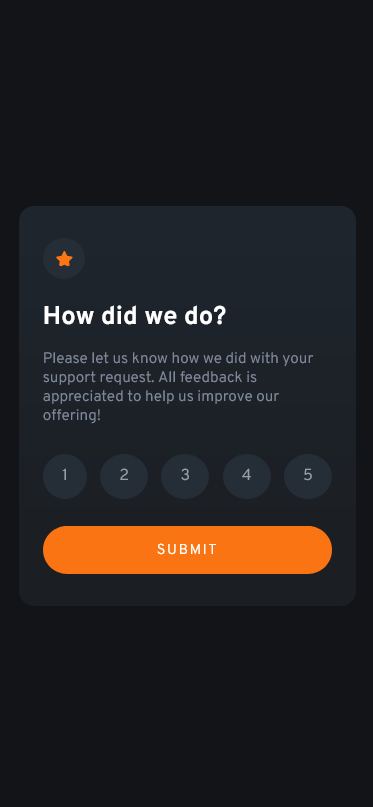
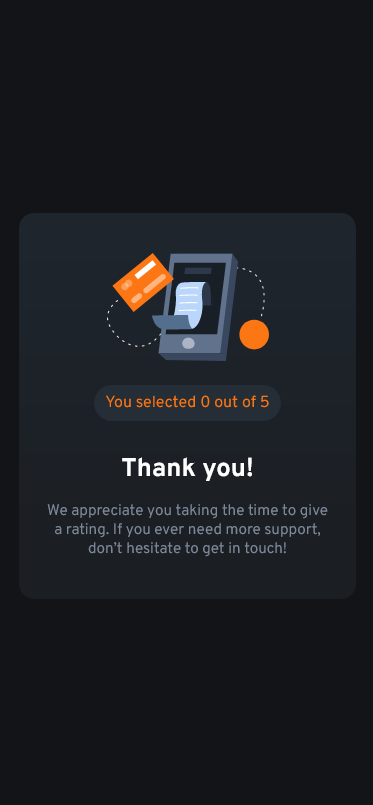

# Frontend Mentor - Interactive rating component solution

This is a solution to the [Interactive rating component challenge on Frontend Mentor](https://www.frontendmentor.io/challenges/interactive-rating-component-koxpeBUmI).

## Table of contents

- [Overview](#overview)
  - [The challenge](#the-challenge)
  - [Screenshot](#screenshot)
  - [Links](#links)
- [My process](#my-process)
  - [Built with](#built-with)
  - [What I learned](#what-i-learned)
  - [Continued development](#continued-development)
- [Author](#author)

## Overview

### The challenge

Users should be able to:

- View the optimal layout for the app depending on their device's screen size
- See hover states for all interactive elements on the page
- Select and submit a number rating
- See the "Thank you" card state after submitting a rating

### Screenshot




### Links

- Solution URL: [https://github.com/lidiakrajewska/interactive-rating-component](https://your-solution-url.com)
- Live Site URL: [https://lidiakrajewska.github.io/interactive-rating-component/](https://your-live-site-url.com)

## My process

### Built with

- Semantic HTML5 markup
- SASS
- Flexbox
- Mobile-first workflow
- JavaScript

### What I learned

It was my first project following the design that wasn't created by me. I used _:not_ selector for the first time to solve the issue of both rating and thank you card being displayed at once, because of overwriting display property from _invisible_ class in _thank_ class:

```css
.thank:not(.invisible) {
  display: flex;
  flex-direction: column;
  align-items: center;
  justify-content: center;
  padding: 2.5rem 1.5rem;
  text-align: center;
}
```

### Continued development

I struggle the most with JS, so this is the area that I would like to focus on in my learning. I will also continuously try to improve organising my code and look for ways to reuse styles as much as possible.

## Author

- Frontend Mentor - [@lidiakrajewska](https://www.frontendmentor.io/profile/lidiakrajewska)
- LinkedIn - [Lidia Krajewska](https://www.linkedin.com/in/lidia-krajewska-02512a1a7/)
